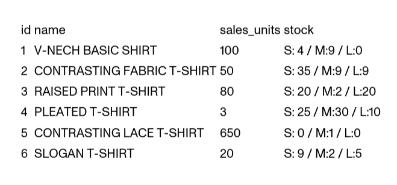

# Inditex Caso Práctico Backend Tools

Dado un listado de productos que se muestra en una categoría de camisetas se necesita implementar un algoritmo que permita ordenar ese listado en base a una serie de criterios de ordenación. Cada criterio de ordenación tendrá un peso asociado de manera que la puntuación de cada producto a ordenar vendrá dada por la suma ponderada de los criterios.

Los criterios de ordenación definidos serán el criterio de ventas por unidades y el criterio de ratio de stock, puede que a futuro se añadan nuevos criterios.

El criterio de ventas por unidades dará una puntuación a cada producto basado en el número de unidades vendidas.

El criterio de ratio de stock dará una puntuación en función de las tallas que contengan stock en ese momento

El listado de productos es el siguiente:



La funcionalidad debe exponerse a través de un servicio REST de manera que recibirá los pesos para cada criterio.

Queda a libre elección el lenguaje y frameworks a utilizar para la implementación.

## Estructura del código

He estructurado el código aplicando las directrices que establece la arquitectura hexagonal:

- Capa de dominio: conceptos de nuestro contexto y reglas de negocio que vienen determinadas por el ámbito específico en el que se resuelve el problema.
- Capa de aplicación: conjunto de casos de uso que habilitan las funcionalidades que requieren los usuarios.
- Capa de infrastructura: conjunto de servicios encargados de las operaciones de entrada/salida (persistencia, controladores, emisión de eventos...). En esta capa residen las implementaciones concretas de las interfaces definidas a nivel de domino.

## Casos de uso

A continuación se enumeran los casos de uso añadidos para la resolución de la prueba así como sus particularidades:

### **Creación de productos**

Permite crear el agregado principal de la prueba `Product`:

- Fichero: `src/main/java/com/acidtango/itxbackendtools/catalog/products/application/CreateProduct.java`
- Endpoint: `POST /products`
- Parámetros: nombre del producto
- Resultado: identificador del producto recién creado

### **Restock**

Permite añadir unidades al stock de un producto:

- Fichero: `src/main/java/com/acidtango/itxbackendtools/catalog/products/application/RestockProduct.java`
- Endpoint: `POST /products/${productId}/restock`
- Parámetros: identificador del producto y map con las unidades que se reponen para cada talla del producto
- Resultado `void`

### **Obtener un producto**

Permite obtener los detalles de un producto:

- Fichero: `src/main/java/com/acidtango/itxbackendtools/catalog/products/application/GetProduct.java`
- Endpoint `GET /products/${productId}`
- Parámetros: identificador del producto que se desea obtener
- Resultado: detalles del producto solicitado

### **Creación de ventas**

Permite crear ventas y aumentar así la cantidad de unidades vendidas de un producto determinado. Ha sido muy conveniente añadir este caso de uso porque ha habilitado la posibilidad de incluir un segundo agregado `Sale` y un evento de dominio `SaleCreated` al que tiene que reaccionar el agregado `Product` realizando efectos colaterales.

- Fichero: `src/main/java/com/acidtango/itxbackendtools/catalog/sales/application/CreateSale.java`
- Endpoint: `POST /sales`
- Parámetros: lista de items de la venta, cada item contiene el identificador del producto vendido, la talla y
  las unidades
- Resultado: identificador de la venta recién creada

### **Obtener el listado de productos**

Caso de uso principal de la prueba técnica. Los casos de uso **Restock** y **Creación de ventas** permiten alterar las cantidades que tienen en cuenta los criterios de ordenación de los productos. El valor por defecto de los pesos de los criterios de ordenación es 1.0. Como particularidad a destacar, este caso de uso se apoya en un repositorio de modelos de escritura en el que se computa el `SortingScore` de cada producto. Nótese que tanto el cálculo de dicho campo como la definición de `ProductReadModel` residen en la capa de dominio.

- Fichero: `src/main/java/com/acidtango/itxbackendtools/catalog/products/application/ListProducts.java`
- Endpoint: `GET /products`
- Parámetros: peso de cada uno de los criterios de ordenación definidos `saleUnitsWeight` y `stockWeight`
- Resultado: listado de productos ordenados según la especificación de ordenación requerida

### ¿Cómo extendemos la ordenación de productos?

En el enunciado de la prueba se menciona que es posible que en el futuro se añadan nuevos criterios de ordenación, a continuación se enumeran los pasos que habría que seguir para ello:

1. Crear una nueva clase que extienda `ProductsSortingCriteria` e implemente su método abstracto `ProductsSortingScore computeScore(Product product)`. `computeScore` se encargará de obtener la puntuación de ordenación para un producto concreto.
2. Añadir el nuevo criterio de ordenación en `ProductsSortingSpecification`, se necesitará una nueva variable que especifique el peso del nuevo criterio y habrá de instanciarse y usarse la clase resultante del primer paso en el método `computeCompoundSortingScore`.
3. Añadir el query param del peso del nuevo criterio de ordenación al endpoint de listado de productos, de manera que los consumidores de la API puedan asignar un peso personalizado.

### Estrategia de testing

La estrategia de testing seguida para la prueba es la siguiente:

- Test unitario por cada caso de uso: se prueban los diferentes escenarios (de éxito o error) que se pueden producir
- Test de integración por repositorio de MongoDB: se prueba que los métodos que expone dicho repositorio funcionen de la manera esperada
- Test end-to-end ejemplificando el supuesto del enunciado: en él, se asegura el correcto funcionamiento del caso de uso principal de la prueba técnica, el listado de productos con los criterios de ordenación. Como se trata de un test e2e, se debe realizar una fase de preparación de los datos, dicha fase de preparación depende totalmente del resto de endpoints por lo que puede verse como un test que engloba toda la aplicación. Puede encontrarse en `src/test/java/com/acidtango/itxbackendtools/catalog/InditexBackendToolsCaseStudyTest.java`

### Ejecución de los tests

Para lanzar los tests es necesario levantar una instancia en local de MongoDB con el siguiente comando:

```bash
docker compose up database
```

Una vez se haya iniciado el contenedor con la bbdd, podemos lanzar los tests en otra terminal con:

```bash
./mvwn test
```

### Ejecución de la prueba

Ejecutando el siguiente comando levantaremos un contenedor para la API y otro para la base de datos. La API empezará a aceptar peticiones en el puerto `8080` mientras que la instancia de MongoDB será accesible a través del puerto `27017`:

```bash
docker compose up
```
